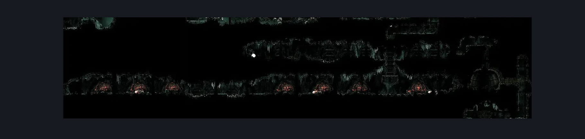
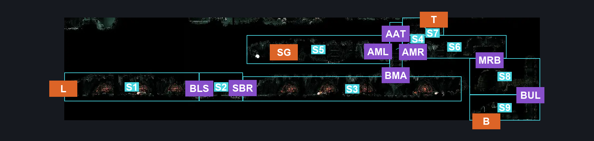
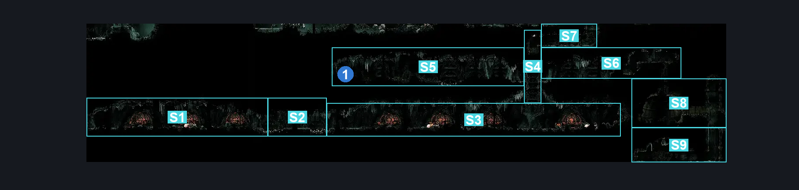

# Whiteward Descent Connection (Ward_03)

**Game ID:** Ward_03

**Contributors:** skai

## Subrooms

| No. | Subroom | Annotated |
| --- | --- | --- |
| S1 | Bottom (Left) | ✓ |
| S2 | Spikes | ✓ |
| S3 | Bottom (Middle) | ✓ |
| S4 | Ascent | ✓ |
| S5 | Middle (Left) | ✓ |
| S6 | Middle (Right) | ✓ |
| S7 | Top | ✓ |
| S8 | Bottom Right (Upper) | ✓ |
| S9 | Bottom Right (Lower) | ✓ |

## Room Transitions

| Alias | Name | From subroom | Destination | Destination alias | Requirements | TODO | Verification | Annotated | Notes |
| --- | --- | --- | --- | --- | --- | --- | --- | --- | --- |
| L | Left | Bottom (Left) | [Whiteward Entrance (Ward_01)](whiteward-entrance.md) | BR | Nothing |  | Verified | ✓ |  |
| B | Bottom | Bottom Right (Lower) | [Whiteward Descent (Ward_06)](whiteward-descent.md) | T | Nothing |  | Verified | ✓ |  |
| T | Top | Top | [Whiteward Junk Dump (Ward_07)](whiteward-junk-dump.md) | B | Nothing |  | Verified | ✓ |  |
| SG | SG | Middle (Left) | [Whiteward Sherma Gauntlet (Ward_09)](whiteward-sherma-gauntlet.md) | L | Complete THE Balm for the Wounded Wish Promised |  | Verified | ✓ |  |

## Subroom Connections

| Alias | Name | Source | Destination | Requirements | TODO | Verification | Annotated | Notes |
| --- | --- | --- | --- | --- | --- | --- | --- | --- |
| BLS | Bottom Left to Spikes | Bottom (Left) | Spikes | Spike Pogo OR Dash OR Sprint OR Sharpdart OR Clawline OR Faydown OR Drifter's Cloak OR Have Flea Brew OR Easy Plasmium Phial Stall OR Easy Voltvessels Stall |  | Verified | ✓ |  |
| BLS | Bottom Left to Spikes | Spikes | Bottom (Left) | Spike Pogo OR Dash OR Sprint OR Sharpdart OR Clawline OR Faydown OR Drifter's Cloak OR Have Flea Brew OR Easy Plasmium Phial Stall OR Easy Voltvessels Stall |  | Verified | ✓ |  |
| SBR | Spikes to Bottom Right | Spikes | Bottom (Middle) | Spike Pogo  OR Dash OR Sprint OR Sharpdart OR Clawline OR Faydown OR Drifter's Cloak OR Flea Brew OR Easy Plasmium Phial Stall OR Easy Voltvessels Stall |  | Verified | ✓ |  |
| SBR | Spikes to Bottom Right | Bottom (Middle) | Spikes | Spike Pogo  OR Dash OR Sprint OR Sharpdart OR Clawline OR Faydown OR Drifter's Cloak OR Flea Brew OR Easy Plasmium Phial Stall OR Easy Voltvessels Stall |  | Verified | ✓ |  |
| BMA | Bottom to Ascent | Bottom (Middle) | Ascent | Cling Grip OR Scuttlebrace OR Silk Soar OR Faydown |  | Verified | ✓ |  |
| BMA | Bottom to Ascent | Ascent | Bottom (Middle) | Cling Grip OR Scuttlebrace OR Silk Soar OR Faydown |  | Verified | ✓ |  |
| AML | Ascent to Middle Left | Ascent | Middle (Left) | Cling Grip OR Scuttlebrace OR Silk Soar OR Faydown |  | Verified | ✓ |  |
| AML | Ascent to Middle Left | Middle (Left) | Ascent | Nothing (Fall) |  | Verified | ✓ |  |
| AMR | Ascent to Middle Right | Ascent | Middle (Right) | Cling Grip OR Scuttlebrace OR Silk Soar OR Faydown |  | Verified | ✓ |  |
| AMR | Ascent to Middle Right | Middle (Right) | Ascent | Nothing (Fall) |  | Verified | ✓ |  |
| MRB | Middle Right to Bottom | Bottom Right (Upper) | Middle (Right) | (Magma Bell AND Silk Soar) OR (Faydown AND Cling Grip) |  | Verified | ✓ |  |
| MRB | Middle Right to Bottom | Middle (Right) | Bottom Right (Upper) | Nothing (Fall) |  | Verified | ✓ |  |
| AAT | Ascent to Top | Ascent | Top | Cling Grip OR Silk Soar OR Faydown |  | Verified | ✓ |  |
| AAT | Ascent to Top | Top | Ascent | Cling Grip OR Silk Soar OR Faydown |  | Verified | ✓ |  |
| BUL | Bottom Right Upper to Lower | Bottom Right (Lower) | Bottom Right (Upper) | Cling Grip OR Silk Soar |  | Verified | ✓ |  |
| BUL | Bottom Right Upper to Lower | Bottom Right (Upper) | Bottom Right (Lower) | Nothing (Fall) |  | Verified | ✓ |  |

## Check Locations

| No. | Check | Subroom | Requirements | TODO | Verification | Location Type | Annotated | Notes |
| --- | --- | --- | --- | --- | --- | --- | --- | --- |
| 1 | Injector Band | Middle (Left) | Nothing |  | Verified | collectible | ✓ |  |

## Room Images

### Scene

### Connections

### Checks

