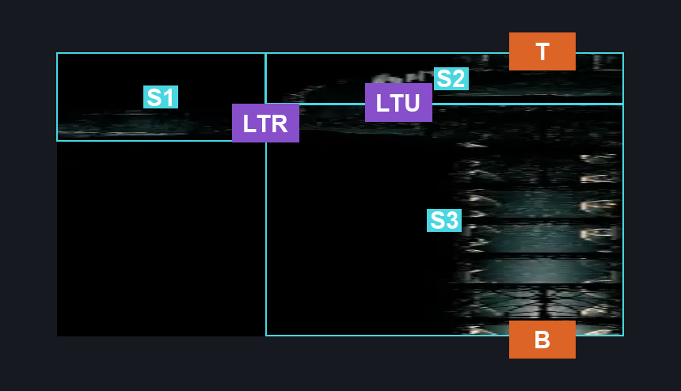
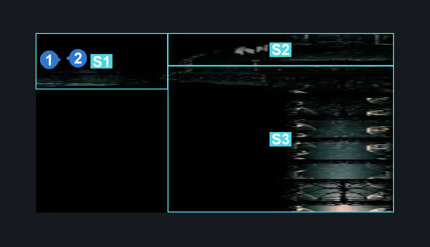
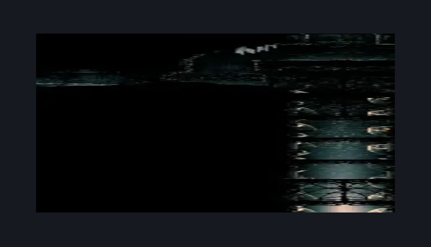

# Whiteward Descent (Ward_06)

**Game ID:** Ward_06

**Contributors:** skai

## Subrooms

| No. | Subroom | Annotated |
| --- | --- | --- |
| S1 | Descent Rosary Side | ✓ |
| S2 | Descent Upper | ✓ |
| S3 | Descent Lower | ✓ |

## Room Transitions

| Alias | Name | From subroom | Destination | Destination alias | Requirements | TODO | Verification | Annotated | Notes |
| --- | --- | --- | --- | --- | --- | --- | --- | --- | --- |
| T | Top | Descent Upper | [Whiteward Descent Connection (Ward_03)](whiteward-descent-connection.md) | B | Nothing |  | Verified | ✓ |  |
| B | Bottom | Descent Lower | [Underworks Twelfth Architect (Under_17)](../underworks/underworks-twelfth-architect.md) | UP | Nothing (Fall) |  | Verified | ✓ |  |

## Subroom Connections

| Alias | Name | Source | Destination | Requirements | TODO | Verification | Annotated | Notes |
| --- | --- | --- | --- | --- | --- | --- | --- | --- |
| LTR | Descent Lower to Rosaries | Descent Lower | Descent Rosary Side | Break Wall Left OR Break Wall Right |  | Verified | ✓ |  |
| LTR | Descent Lower to Rosaries | Descent Rosary Side | Descent Lower | Break Wall Left OR Break Wall Right |  | Verified | ✓ |  |
| LTU | Descent Lower to Upper | Descent Lower | Descent Upper | Cling Grip OR Scuttlebrace OR Silk Soar OR Faydown |  | Verified | ✓ |  |
| LTU | Descent Lower to Upper | Descent Upper | Descent Lower | Nothing (Fall) |  | Verified | ✓ |  |

## Check Locations

| No. | Check | Subroom | Requirements | TODO | Verification | Location Type | Annotated | Notes |
| --- | --- | --- | --- | --- | --- | --- | --- | --- |
| 1 | Whiteward - Rosary Cache #1 | Descent Rosary Side | Nothing |  | Verified | collectible | ✓ |  |
| 2 | Whiteward - Rosary Cache #2 | Descent Rosary Side | Nothing |  | Verified | collectible | ✓ |  |

## Room Images

### Connections

### Checks

### Scene

