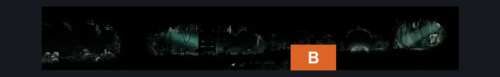
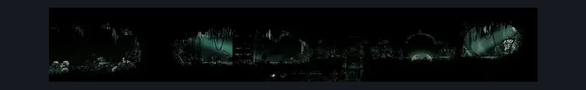

# Whiteward Junk Dump (Ward_07)

**Game ID:** Ward_07

**Contributors:** skai

## Subrooms

No subrooms defined.

## Room Transitions

| Alias | Name | From subroom | Destination | Destination alias | Requirements | TODO | Verification | Annotated | Notes |
| --- | --- | --- | --- | --- | --- | --- | --- | --- | --- |
| B | Bottom |  | [Whiteward Descent Connection (Ward_03)](whiteward-descent-connection.md) | T | Nothing |  | Verified | ✓ |  |

## Subroom Connections

No subroom connections defined.

## Check Locations

| No. | Check | Subroom | Requirements | TODO | Verification | Location Type | Annotated | Notes |
| --- | --- | --- | --- | --- | --- | --- | --- | --- |
| 1 | Whiteward - Oath |  | Nothing |  | Verified | lore | ✓ |  |
| 2 | Surgeon's Key |  | Clawline |  | Verified | collectible | ✓ |  |

## Room Images

### Connections

### Checks

### Scene

