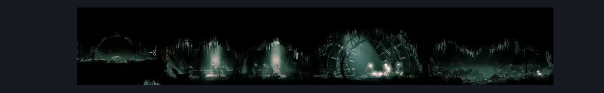

# Whiteward Long Horizontal (Ward_05)

**Game ID:** Ward_05

**Contributors:** skai

## Subrooms

No subrooms defined.

## Room Transitions

| Alias | Name | From subroom | Destination | Destination alias | Requirements | TODO | Verification | Annotated | Notes |
| --- | --- | --- | --- | --- | --- | --- | --- | --- | --- |
| L | Left |  | [Whiteward Entrance (Ward_01)](whiteward-entrance.md) | TR | Nothing |  | Verified | ✓ |  |

## Subroom Connections

No subroom connections defined.

## Check Locations

| No. | Check | Subroom | Requirements | TODO | Verification | Location Type | Annotated | Notes |
| --- | --- | --- | --- | --- | --- | --- | --- | --- |
| 1 | Relic: Choral Commandment (Eastern Whiteward) |  | Nothing |  | Verified | collectible | ✓ |  |

## Room Images

### Scene

### Connections

### Checks

