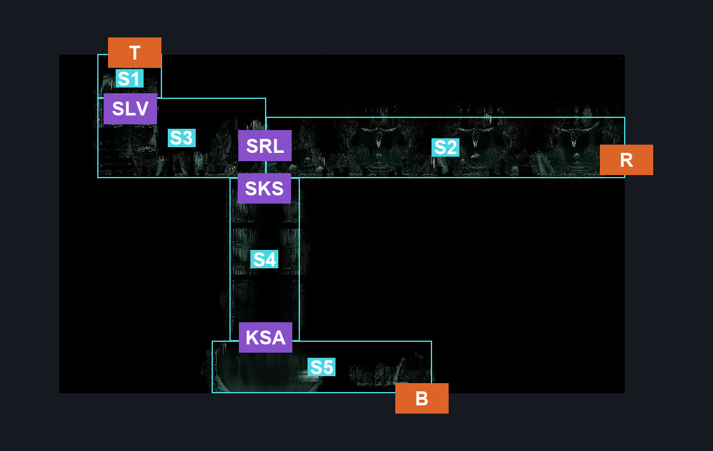
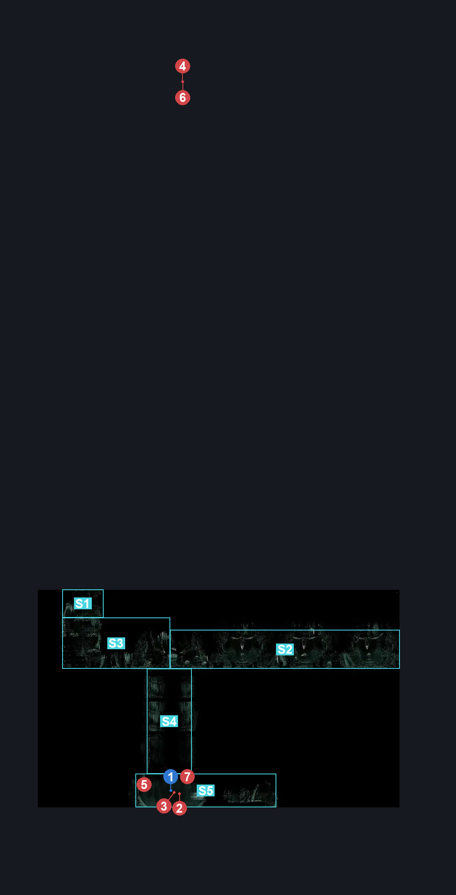
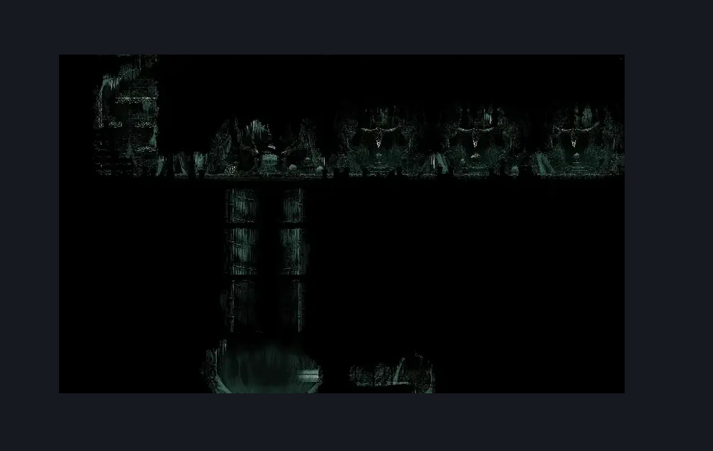

# Whiteward Unravelled Arena Room (Ward_02)

**Game ID:** Ward_02

**Contributors:** skai

## Subrooms

| No. | Subroom | Annotated |
| --- | --- | --- |
| S1 | Vertical Left | ✓ |
| S2 | Surgery Tables (Right) | ✓ |
| S3 | Surgery Tables (Left) | ✓ |
| S4 | Key Shaft | ✓ |
| S5 | Unravelled Arena | ✓ |

## Room Transitions

| Alias | Name | From subroom | Destination | Destination alias | Requirements | TODO | Verification | Annotated | Notes |
| --- | --- | --- | --- | --- | --- | --- | --- | --- | --- |
| T | Top | Vertical Left | [Whiteward Tunnel Room (Ward_02b)](whiteward-tunnel-room.md) | B | Silk Soar OR Faydown OR Cling Grip OR Scuttlebrace |  | Verified | ✓ |  |
| R | Right | Surgery Tables (Right) | [Whiteward Entrance (Ward_01)](whiteward-entrance.md) | BL | Nothing |  | Verified | ✓ |  |
| B | Bottom | Unravelled Arena | [Confession Toll (Under_08)](../underworks/confession-toll.md) | T | Defeat The Unravelled Gauntlet |  | Verified | ✓ |  |

## Subroom Connections

| Alias | Name | Source | Destination | Requirements | TODO | Verification | Annotated | Notes |
| --- | --- | --- | --- | --- | --- | --- | --- | --- |
| SLV | Surgery Left to Vertical | Surgery Tables (Left) | Vertical Left | Ledge Grab OR Faydown OR Clawline OR Silk Soar OR (Proficient Movement AND Scuttlebrace) |  | Verified | ✓ |  |
| SLV | Surgery Left to Vertical | Vertical Left | Surgery Tables (Left) | Nothing (Falling) |  | Verified | ✓ |  |
| SRL | Surgery Right to Left | Surgery Tables (Right) | Surgery Tables (Left) | Nothing |  | Verified | ✓ |  |
| SRL | Surgery Right to Left | Surgery Tables (Left) | Surgery Tables (Right) | Nothing |  | Verified | ✓ |  |
| SKS | Surgery to Key Shaft | Surgery Tables (Left) | Key Shaft | Have Surgeon's Key |  | Verified | ✓ |  |
| SKS | Surgery to Key Shaft | Key Shaft | Surgery Tables (Left) | Have Surgeon's Key AND Silk Soar |  | Verified | ✓ |  |
| KSA | Key Shaft to Arena | Key Shaft | Unravelled Arena | Nothing (Falling) |  | Verified | ✓ |  |
| KSA | Key Shaft to Arena | Unravelled Arena | Key Shaft | Have Surgeon's Key AND Silk Soar |  | Verified | ✓ |  |

## Check Locations

| No. | Check | Subroom | Requirements | TODO | Verification | Location Type | Annotated | Notes |
| --- | --- | --- | --- | --- | --- | --- | --- | --- |
| 1 | The Unravelled - Silk Heart | Unravelled Arena | Defeat Boss: The Unravelled |  | Verified | collectible | ✓ |  |
| 2 | The Unravelled Gauntlet | Unravelled Arena | Nothing |  | Verified | gauntlet | ✓ |  |
| 3 | Boss: The Unravelled | Unravelled Arena | Defeat The Unravelled Gauntlet |  | Verified | boss | ✓ |  |

## Room Images

### Connections

### Checks

### Scene

