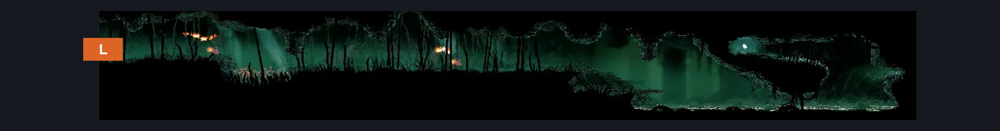
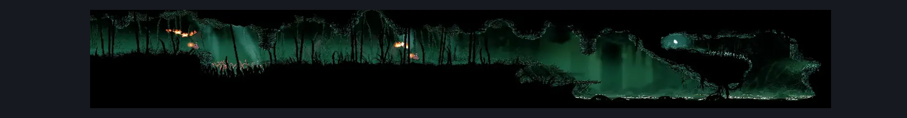

# Eastern Wisp Thicket (Wisp_07)

**Game ID:** Wisp_07

**Contributors:** samupo

## Subrooms

No subrooms defined.

## Room Transitions

| Alias | Name | From subroom | Destination | Destination alias | Requirements | TODO | Verification | Annotated | Notes |
| --- | --- | --- | --- | --- | --- | --- | --- | --- | --- |
| L | left1 |  | [Wisp Thicket Shaft (Wisp_08)](wisp-thicket-shaft.md) | R | none |  | Verified | ✓ |  |

## Subroom Connections

No subroom connections defined.

## Check Locations

| No. | Check | Subroom | Requirements | TODO | Verification | Location Type | Annotated | Notes |
| --- | --- | --- | --- | --- | --- | --- | --- | --- |
| 1 | Mask Shard: Wisp Thicket |  | cling grip AND (clawline OR (faydown cloak AND spike pogo)) |  | Verified | collectible |  |  |
| 2 | import enemies |  |  | TODO | Needs verification |  |  |  |

## Room Images

### Connections

### Checks

### Scene

