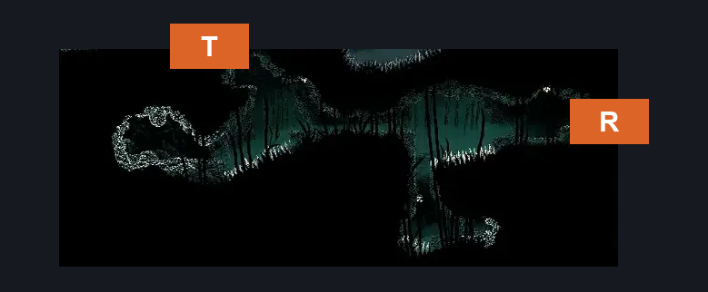
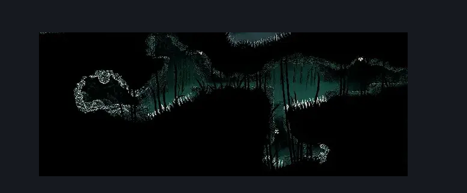

# Wisp Thicket Cave (Wisp_09)

**Game ID:** Wisp_09

**Contributors:** samupo

## Subrooms

No subrooms defined.

## Room Transitions

| Alias | Name | From subroom | Destination | Destination alias | Requirements | TODO | Verification | Annotated | Notes |
| --- | --- | --- | --- | --- | --- | --- | --- | --- | --- |
| R | right1 |  | [Wisp Thicket Secret Path (Wisp_05)](wisp-thicket-secret-path.md) | L | spike pogo OR clawline OR drifter's cloak OR (faydown cloak AND dash) |  |  | ✓ |  |
| T | top1 |  | [Underworks Wisp Thicket Passage (Under_23)](../underworks/underworks-wisp-thicket-passage.md) | B | faydown cloak |  |  | ✓ |  |

## Subroom Connections

No subroom connections defined.

## Check Locations

| No. | Check | Subroom | Requirements | TODO | Verification | Location Type | Annotated | Notes |
| --- | --- | --- | --- | --- | --- | --- | --- | --- |
| 1 | Shell Shard Cache: Wisp Thicket #6 |  | (dash AND cling grip) OR clawline OR spike pogo OR drifter's cloak | TODO |  | collectible |  | May have different requirements if entered from the top |
| 2 | Shell Shard Cache: Wisp Thicket #7 |  | (dash AND cling grip) OR clawline OR spike pogo OR drifter's cloak | TODO |  | collectible |  | May have different requirements if entered from the top |
| 3 | Shell Shard Cache: Wisp Thicket #1 |  | dash OR faydown cloak OR clawline OR spike pogo OR drifter's cloak |  |  | collectible |  |  |
| 4 | Shell Shard Cache: Wisp Thicket #2 |  | dash OR faydown cloak OR clawline OR spike pogo OR drifter's cloak |  |  | collectible |  |  |
| 5 | Shell Shard Cache: Wisp Thicket #3 |  | dash OR faydown cloak OR clawline OR spike pogo OR drifter's cloak |  |  | collectible |  |  |
| 6 | Shell Shard Cache: Wisp Thicket #4 |  | dash OR faydown cloak OR clawline OR spike pogo OR drifter's cloak |  |  | collectible |  |  |
| 7 | Shell Shard Cache: Wisp Thicket #5 |  | dash OR faydown cloak OR clawline OR spike pogo OR drifter's cloak |  |  | collectible |  |  |
| 8 | import enemies |  |  | TODO | Needs verification |  |  |  |

## Room Images

### Connections

### Checks

### Scene

