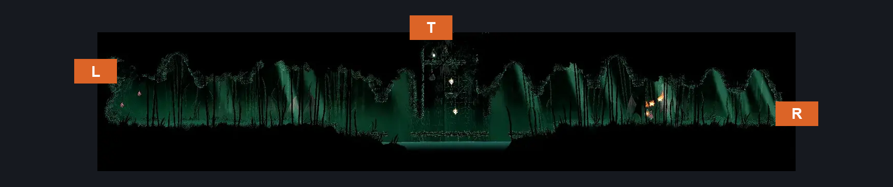
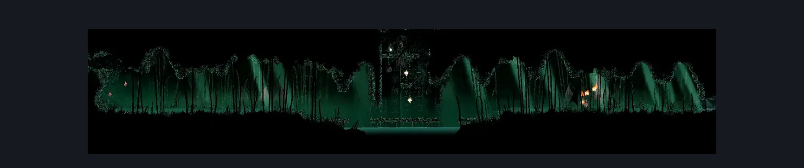

# Wisp Thicket Grounds (Wisp_02)

**Game ID:** Wisp_02

**Contributors:** samupo

## Subrooms

No subrooms defined.

## Room Transitions

| Alias | Name | From subroom | Destination | Destination alias | Requirements | TODO | Verification | Annotated | Notes |
| --- | --- | --- | --- | --- | --- | --- | --- | --- | --- |
| T | top1 |  | [Wisp Thicket Secret Path (Wisp_05)](wisp-thicket-secret-path.md) | B | silk soar OR cling grip |  |  | ✓ |  |
| R | right1 |  | [Wisp Thicket Bench (Wisp_04)](wisp-thicket-bench.md) | L | none |  |  | ✓ |  |
| L | left1 |  | [Father of the Flame (Belltown_08)](father-of-the-flame.md) | R | ledge grab OR faydown cloak OR silk soar |  |  | ✓ |  |

## Subroom Connections

No subroom connections defined.

## Check Locations

| No. | Check | Subroom | Requirements | TODO | Verification | Location Type | Annotated | Notes |
| --- | --- | --- | --- | --- | --- | --- | --- | --- |
| 1 | Rosary Necklace: Wisp Thicket |  | silk soar OR cling grip |  |  | collectible |  |  |
| 2 | import enemies |  |  | TODO | Needs verification |  |  |  |

## Room Images

### Connections

### Checks

### Scene

