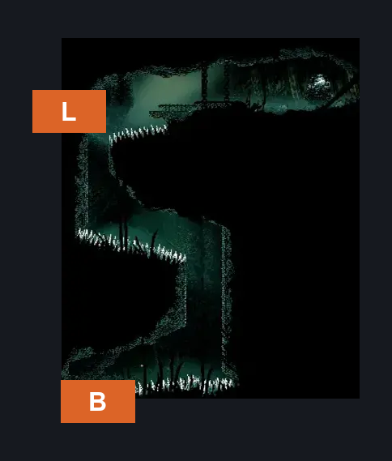
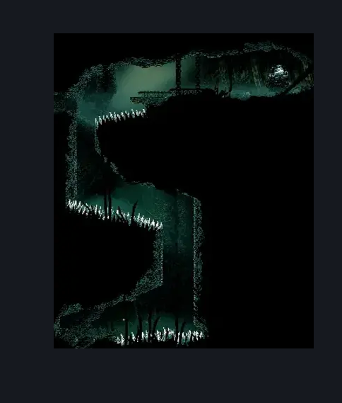

# Wisp Thicket Secret Path (Wisp_05)

**Game ID:** Wisp_05

**Contributors:** samupo

## Subrooms

| No. | Subroom | Annotated |
| --- | --- | --- |
| S1 | Top |  |
| S2 | Bottom |  |

## Room Transitions

| Alias | Name | From subroom | Destination | Destination alias | Requirements | TODO | Verification | Annotated | Notes |
| --- | --- | --- | --- | --- | --- | --- | --- | --- | --- |
| B | bot1 | Bottom | [Wisp Thicket Grounds (Wisp_02)](wisp-thicket-grounds.md) | T | none |  |  | ✓ |  |
| L | left1 | Top | [Wisp Thicket Cave (Wisp_09)](wisp-thicket-cave.md) | R | none |  |  | ✓ |  |

## Subroom Connections

| Alias | Name | Source | Destination | Requirements | TODO | Verification | Annotated | Notes |
| --- | --- | --- | --- | --- | --- | --- | --- | --- |
| V | Vertical | Bottom | Top | cling grip AND (spike pogo OR (faydown cloak AND clawline)) |  |  |  |  |
| V | Vertical | Top | Bottom | spike pogo OR drifter's cloak |  |  |  |  |

## Check Locations

| No. | Check | Subroom | Requirements | TODO | Verification | Location Type | Annotated | Notes |
| --- | --- | --- | --- | --- | --- | --- | --- | --- |
| 1 | Craftmetal: Wisp Thicket | Top | none |  |  | collectible |  |  |

## Room Images

### Connections

### Checks

### Scene

