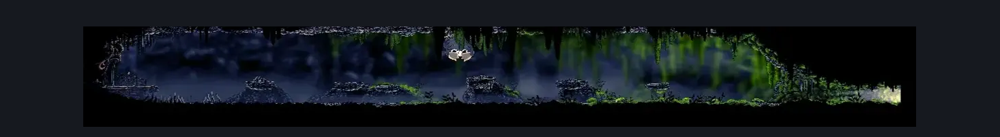
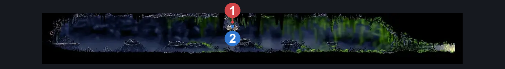

# Wormways Craggler Hallway (Crawl_04)

**Game ID:** Crawl_04

**Contributors:** herounit, cry

## Subrooms

No subrooms defined.

## Room Transitions

| Alias | Name | From subroom | Destination | Destination alias | Requirements | TODO | Verification | Annotated | Notes |
| --- | --- | --- | --- | --- | --- | --- | --- | --- | --- |
| L | left |  | [Wormways Shaft (Crawl_02)](wormways-shaft.md) | LR | none |  | Verified |  |  |
| R | right |  | [The Big Fall (Aspid_01)](../bone-bottom/the-big-fall.md) | LL | none |  | Verified |  |  |

## Subroom Connections

No subroom connections defined.

## Check Locations

| No. | Check | Subroom | Requirements | TODO | Verification | Location Type | Annotated | Notes |
| --- | --- | --- | --- | --- | --- | --- | --- | --- |
| 1 | craggler mini boss fight |  | none |  | Verified | miniboss | ✓ |  |
| 2 | craggler beast shard |  | defeat craggler mini boss fight |  | Verified | collectible | ✓ |  |

## Notes

cry: were we adding craggler into logic?
should at bare minimum have dash or run in combat logic

## Room Images

### Connections

### Checks

### Scene

