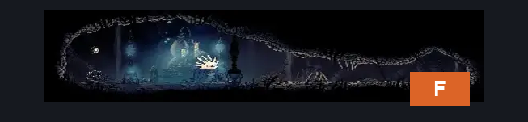
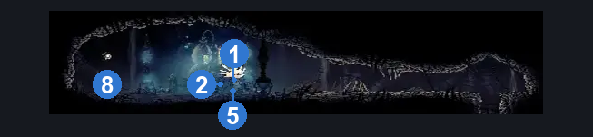
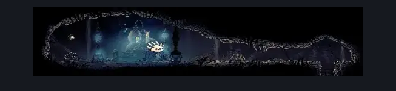

# Wormways Laboratory (Crawl_08)

**Game ID:** Crawl_08

**Contributors:** herounit, cry

## Subrooms

No subrooms defined.

## Room Transitions

| Alias | Name | From subroom | Destination | Destination alias | Requirements | TODO | Verification | Annotated | Notes |
| --- | --- | --- | --- | --- | --- | --- | --- | --- | --- |
| F | floor |  | [Wormways Upper West (Crawl_03)](wormways-upper-west.md) | C | none |  | Verified | ✓ |  |

## Subroom Connections

No subroom connections defined.

## Check Locations

| No. | Check | Subroom | Requirements | TODO | Verification | Location Type | Annotated | Notes |
| --- | --- | --- | --- | --- | --- | --- | --- | --- |
| 1 | needle phial |  | complete alchemist's assistant wish promised OR complete advanced alchemy wish promised |  | Verified | collectible | ✓ | This tool is removed from your inventory after completing either wish. |
| 2 | plasmium phial |  | complete alchemist's assistant wish granted |  | Verified | collectible | ✓ |  |
| 3 | plasmium gland |  | complete advanced alchemy wish granted |  | Verified | collectible |  |  |
| 4 | alchemist's assistant wish promised |  | none |  | Verified | collectible |  |  |
| 5 | alchemist's assistant wish granted |  | complete alchemist's assistant wish promised AND complete THE plasmium bud upper west AND complete THE plasmium bud lower west AND complete THE plasmium bud lower east |  | Verified | event | ✓ |  |
| 6 | advanced alchemy wish promised |  | act 3  AND complete alchemist's assistant wish granted |  | Verified | event |  |  |
| 7 | advanced alchemy wish granted |  | act 3  AND complete advanced alchemy wish promised AND get 10 plasmified blood |  | Verified | event |  |  |
| 8 | laboratory bench |  | none |  | Verified | bench | ✓ |  |

## Notes

cry: haven't fully verified act 3 stuff aside from a quick spot check, trying not to spoil myself more than i have to sorry
hero: all good, I gotchu (also insane that you are doing logic contributions before even beating the game LOL)

## Room Images

### Connections

### Checks

### Scene

