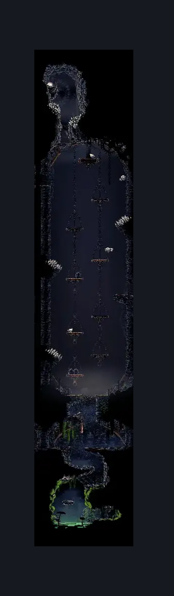
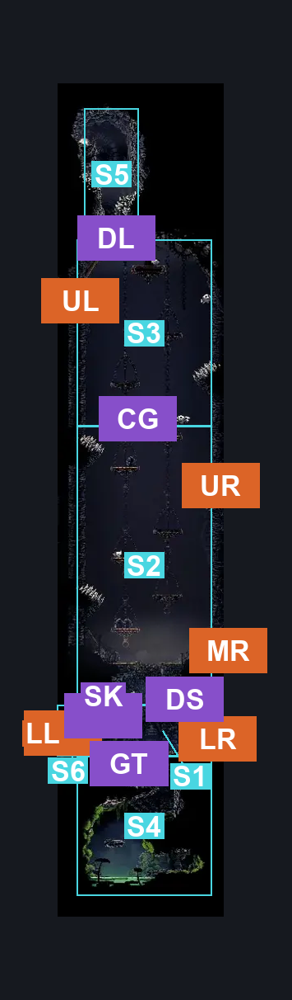
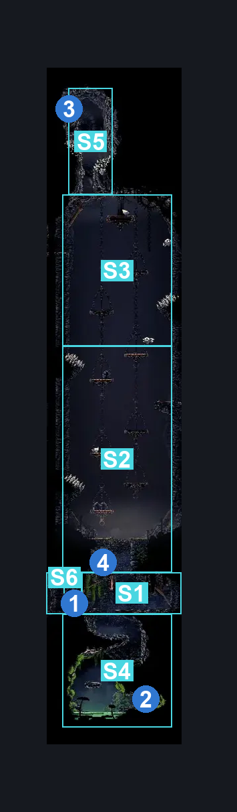

# Wormways Shaft (Crawl_02)

**Game ID:** Crawl_02

**Contributors:** herounit, cry

## Subrooms

| No. | Subroom | Annotated |
| --- | --- | --- |
| S1 | entrance tunnel | ✓ |
| S2 | middle platform area | ✓ |
| S3 | upper platform area | ✓ |
| S4 | mask grotto | ✓ |
| S5 | rosary duct | ✓ |
| S6 | behind door | ✓ |

## Room Transitions

| Alias | Name | From subroom | Destination | Destination alias | Requirements | TODO | Verification | Annotated | Notes |
| --- | --- | --- | --- | --- | --- | --- | --- | --- | --- |
| LR | lower right | entrance tunnel | [Wormways Craggler Hallway (Crawl_04)](wormways-craggler-hallway.md) | L | none |  | Verified | ✓ |  |
| LL | lower left | behind door | [Wormways Middle (Crawl_03b)](wormways-middle.md) | R | none |  | Verified | ✓ | there's a pocket of air behind the door and it is not enforced on the other side |
| UL | upper left | upper platform area | [Wormways Upper West (Crawl_03)](wormways-upper-west.md) | R | clear shaft wall blockade IN Wormways Upper West |  | Verified | ✓ |  |
| UR | upper right | middle platform area | [Wormways Upper East (Crawl_01)](wormways-upper-east.md) | L | none |  | Verified | ✓ |  |
| MR | middle right | middle platform area | [Wormways Flea Rescue (Crawl_06)](wormways-flea-rescue.md) | L | break wall {right} |  | Verified | ✓ |  |

## Subroom Connections

| Alias | Name | Source | Destination | Requirements | TODO | Verification | Annotated | Notes |
| --- | --- | --- | --- | --- | --- | --- | --- | --- |
| DS | door switch | middle platform area | entrance tunnel | none (door switch is on this side) |  | Verified | ✓ |  |
| DS | door switch | entrance tunnel | middle platform area | prereq flip door switch AND (cling grip OR (ledge grab AND faydown cloak) OR scuttlebrace OR silk soar) |  | Verified | ✓ |  |
| CG | platform gaps | middle platform area | upper platform area | (ledge grab AND (silk soar OR cling grip OR scuttlebrace OR faydown cloak)) OR (silk soar OR cling grip OR scuttlebrace) OR (faydown cloak AND (easy shaman pogo OR easy beast pogo OR easy reaper pogo OR easy architect pogo)) |  | Verified | ✓ |  |
| CG | platform gaps | upper platform area | middle platform area | none (falling) |  | Verified | ✓ |  |
| GT | grotto tunnel | entrance tunnel | mask grotto | none (falling) |  | Verified | ✓ |  |
| GT | grotto tunnel | mask grotto | entrance tunnel | ledge grab OR (cling grip OR faydown cloak OR scuttlebrace OR silk soar) |  | Verified | ✓ |  |
| DL | duct ledge | upper platform area | rosary duct | cling grip OR scuttlebrace |  | Verified | ✓ |  |
| DL | duct ledge | rosary duct | upper platform area | none (falling) |  | Verified | ✓ |  |
| SK | simple key lock | entrance tunnel | behind door | unlock Wormways Simple Lock |  | Verified | ✓ |  |
| SK | simple key lock | behind door | entrance tunnel | unlock Wormways Simple Lock |  | Verified | ✓ |  |

## Check Locations

| No. | Check | Subroom | Requirements | TODO | Verification | Location Type | Annotated | Notes |
| --- | --- | --- | --- | --- | --- | --- | --- | --- |
| 1 | Wormways Simple Lock | entrance tunnel | have Simple Key Wormways |  | Verified | lock | ✓ | unlocks the LL room exit |
| 2 | mask shard wormways | mask grotto | (ledge grab OR cling grip OR silksoar OR faydown cloak) |  | Verified | collectible | ✓ | current hazard respawn from grotto water makes the theoretical no-swim req arbitrary, (you spawn in the entrance tunnel  or in the shaft if you came from above) |
| 3 | frayed rosary string wormways | rosary duct | (ledge grab AND (cling grip OR silk soar OR scuttlebrace)) OR (cling grip OR silk soar OR (scuttlebrace AND (flea brew OR clawline OR sharpdart OR faydown cloak))) |  | Verified | collectible | ✓ |  |
| 4 | flip door switch | middle platform area | flip switch down |  | Verified | switch | ✓ | unlocks the middle/lower shortcut |

## Room Images

### Scene

### Connections

### Checks

