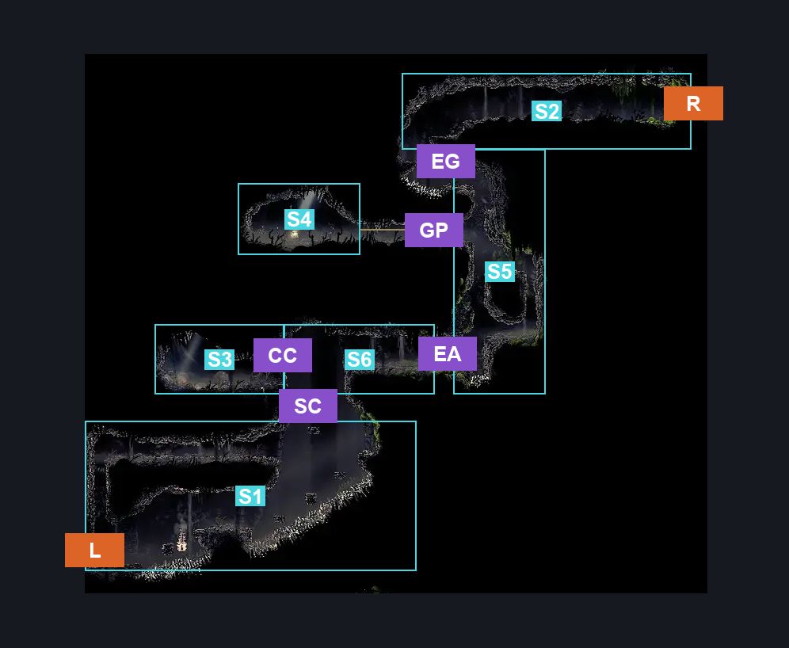
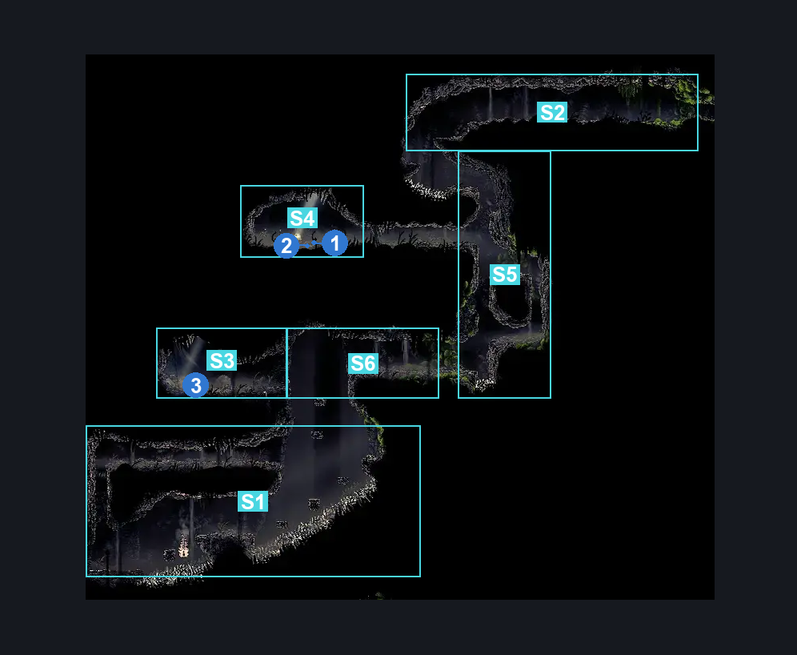
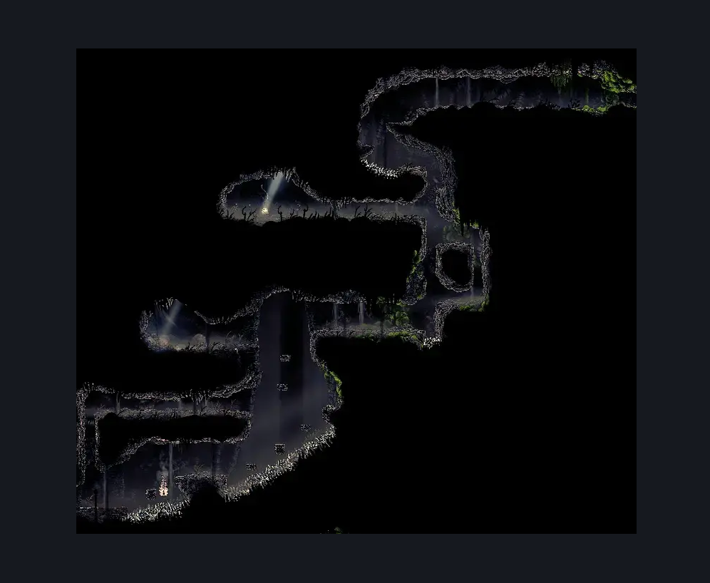

# Wormways Upper East (Crawl_01)

**Game ID:** Crawl_01

**Contributors:** herounit, cry

## Subrooms

| No. | Subroom | Annotated |
| --- | --- | --- |
| S1 | spike abyss | ✓ |
| S2 | upper exit tunnel | ✓ |
| S3 | shakra camp | ✓ |
| S4 | pilgrim grave | ✓ |
| S5 | central elevator | ✓ |
| S6 | abyss crossing | ✓ |

## Room Transitions

| Alias | Name | From subroom | Destination | Destination alias | Requirements | TODO | Verification | Annotated | Notes |
| --- | --- | --- | --- | --- | --- | --- | --- | --- | --- |
| L | left | spike abyss | [Wormways Shaft (Crawl_02)](wormways-shaft.md) | UR | none |  | Verified | ✓ |  |
| R | right | upper exit tunnel | [The Big Fall (Aspid_01)](../bone-bottom/the-big-fall.md) | UL | none |  | Verified | ✓ |  |

## Subroom Connections

| Alias | Name | Source | Destination | Requirements | TODO | Verification | Annotated | Notes |
| --- | --- | --- | --- | --- | --- | --- | --- | --- |
| EG | elevator gap | central elevator | upper exit tunnel | ledge grab OR spike pogo OR run OR dash OR cling grip OR drifter's cloak OR faydown cloak OR sharpdart OR clawline |  | Verified | ✓ |  |
| EG | elevator gap | upper exit tunnel | central elevator | none (falling) |  | Verified | ✓ |  |
| SC | camp abyss climb | abyss crossing | spike abyss | none (falling) |  | Verified | ✓ |  |
| SC | camp abyss climb | spike abyss | abyss crossing | (ledge grab AND (run OR dash OR cling grip OR easy shaman pogo OR easy beast pogo OR clawline OR drifter's cloak OR faydown cloak)) OR (proficient movement AND cling grip) OR faydown cloak OR scuttlebrace OR (cling grip AND (clawline OR sharpdart)) OR silk soar |  | Verified | ✓ |  |
| EA | elevator abyss cross | abyss crossing | central elevator | ledge grab OR cling grip OR faydown cloak OR scuttlebrace OR easy beast pogo |  | Verified | ✓ |  |
| EA | elevator abyss cross | central elevator | abyss crossing | none |  | Verified | ✓ |  |
| GP | grave passage | central elevator | pilgrim grave | ledge grab OR cling grip OR silk soar OR easy enemy pogo OR scuttlebrace OR faydown cloak |  | Verified | ✓ |  |
| GP | grave passage | pilgrim grave | central elevator | none |  | Verified | ✓ |  |
| CC | camp crossing | shakra camp | abyss crossing | none |  | Verified | ✓ |  |
| CC | camp crossing | abyss crossing | shakra camp | none |  | Verified | ✓ |  |

## Check Locations

| No. | Check | Subroom | Requirements | TODO | Verification | Location Type | Annotated | Notes |
| --- | --- | --- | --- | --- | --- | --- | --- | --- |
| 1 | dead bugs purse | pilgrim grave | steel soul off |  | Verified | collectible | ✓ | STILL MARKED AS ??? ON TRACKER |
| 2 | shell satchel | pilgrim grave | steel soul on |  | Verified | collectible | ✓ |  |
| 3 | wormways map | shakra camp | spend 70 rosaries |  | Verified | collectible | ✓ | shakra shop |
| 4 | import enemies |  |  | TODO | Needs verification |  |  |  |

## Notes

cry: elevator abyss cross is one and done if entered from above without the requirements to climb back up the abyss

## Room Images

### Connections

### Checks

### Scene

