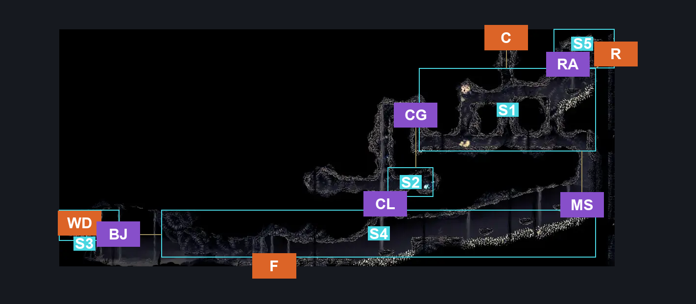
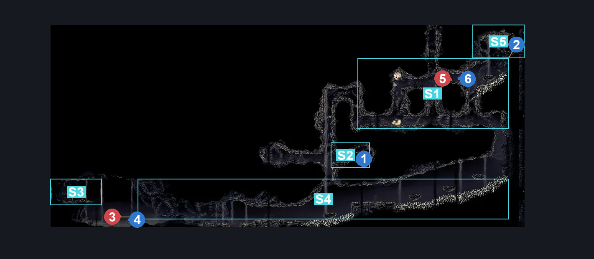
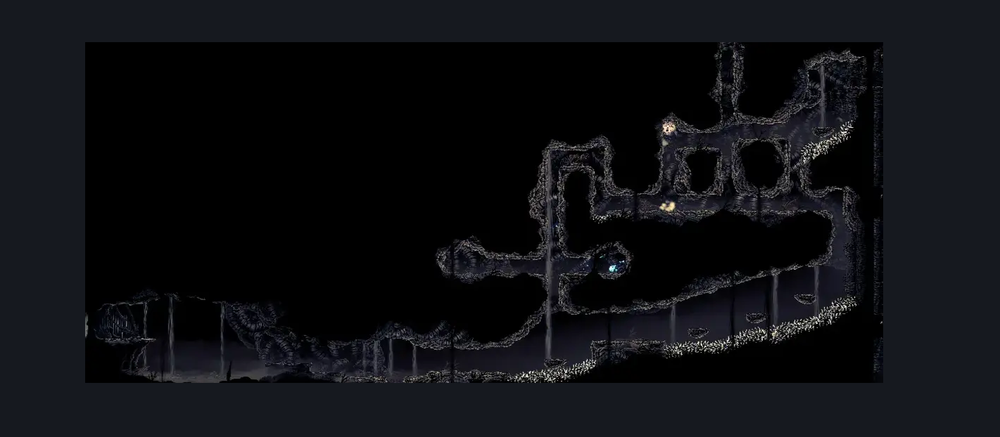

# Wormways Upper West (Crawl_03)

**Game ID:** Crawl_03

**Contributors:** herounit, cry

## Subrooms

| No. | Subroom | Annotated |
| --- | --- | --- |
| S1 | main area upper | ✓ |
| S2 | plasmium alcove | ✓ |
| S3 | weavenest landing | ✓ |
| S4 | main tunnel lower | ✓ |
| S5 | right exit area | ✓ |

## Room Transitions

| Alias | Name | From subroom | Destination | Destination alias | Requirements | TODO | Verification | Annotated | Notes |
| --- | --- | --- | --- | --- | --- | --- | --- | --- | --- |
| F | floor | main tunnel lower | [Wormways Middle (Crawl_03b)](wormways-middle.md) | C | none |  | Verified | ✓ |  |
| R | right | main area upper | [Wormways Shaft (Crawl_02)](wormways-shaft.md) | UL | clear shaft wall blockade |  | Verified | ✓ |  |
| C | ceiling | main area upper | [Wormways Laboratory (Crawl_08)](wormways-laboratory.md) | F | silk soar OR cling grip OR scuttlebrace |  | Verified | ✓ |  |
| WD | weaver door | weavenest landing | [Wormways Weavenest (Crawl_05)](wormways-weavenest.md) | WD | needolin |  | Verified | ✓ |  |

## Subroom Connections

| Alias | Name | Source | Destination | Requirements | TODO | Verification | Annotated | Notes |
| --- | --- | --- | --- | --- | --- | --- | --- | --- |
| CG | upper climb | main area upper | plasmium alcove | (ledge grab AND (cling grip OR faydown cloak OR scuttlebrace)) OR (cling grip OR scuttlebrace OR (faydown cloak AND easy shaman pogo)) |  | Verified | ✓ |  |
| CG | upper climb | plasmium alcove | main area upper | (ledge grab AND (cling grip OR silk soar OR faydown cloak)) OR (silk soar OR cling grip OR scuttlebrace) |  | Verified | ✓ |  |
| BJ | big jump | main tunnel lower | weavenest landing | (ledge grab AND (silk soar OR faydown cloak OR (run AND clawline))) OR silk soar OR faydown cloak OR (run AND clawline AND cling grip) |  | Verified | ✓ |  |
| BJ | big jump | weavenest landing | main tunnel lower | none (falling) |  | Verified | ✓ |  |
| CL | lower climb | main tunnel lower | plasmium alcove | silk soar |  | Verified | ✓ |  |
| CL | lower climb | plasmium alcove | main tunnel lower | none (falling) |  | Verified | ✓ |  |
| MS | main tunnel shaft | main tunnel lower | main area upper | ledge grab OR cling grip OR scuttlebrace OR faydown cloak OR easy enemy pogo |  | Verified | ✓ |  |
| MS | main tunnel shaft | main area upper | main tunnel lower | none (falling) |  | Verified | ✓ |  |
| RA | right ascend | main area upper | right exit area | ledge grab OR faydown cloak OR cling grip OR silk soar OR easy shaman pogo OR scuttlebrace |  | Verified | ✓ |  |
| RA | right ascend | right exit area | main area upper | none (falling) |  | Verified | ✓ |  |

## Check Locations

| No. | Check | Subroom | Requirements | TODO | Verification | Location Type | Annotated | Notes |
| --- | --- | --- | --- | --- | --- | --- | --- | --- |
| 1 | plasmium bud upper west | plasmium alcove | complete THE alchemist's assistant wish promised  AND needle phial |  | Verified | collectible | ✓ |  |
| 2 | shaft wall blockade | main area upper | break wall right |  | Verified | blockade | ✓ |  |
| 3 | plasmid lower | main tunnel lower | act 3 |  | Verified | enemy | ✓ | there are two spawn points in this subroom |
| 4 | plasmified blood lower | main tunnel lower | needle phial  AND defeat plasmid lower |  | Verified | resource | ✓ |  |
| 5 | plasmid upper | main area upper | act 3 |  | Verified | enemy | ✓ |  |
| 6 | plasmified blood upper | main area upper | needle phial  AND defeat plasmid upper |  | Verified | resource | ✓ |  |
| 7 | import enemies |  |  | TODO | Needs verification |  |  |  |

## Notes

does anything show up in that tunnel opposite to the plasmium alcove later on? feels like there'd be an item or something relevant there

## Room Images

### Connections

### Checks

### Scene

