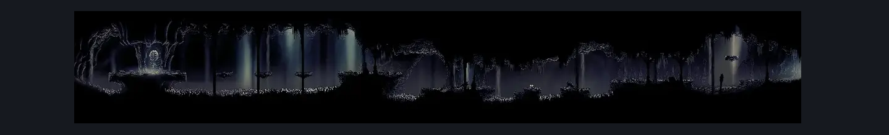
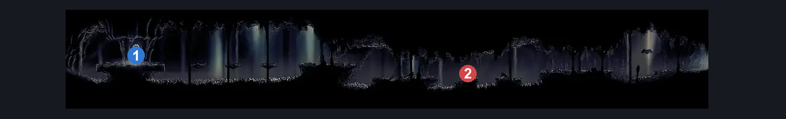

# Wormways Weavenest (Crawl_05)

**Game ID:** Crawl_05

**Contributors:** herounit, cry

## Subrooms

No subrooms defined.

## Room Transitions

| Alias | Name | From subroom | Destination | Destination alias | Requirements | TODO | Verification | Annotated | Notes |
| --- | --- | --- | --- | --- | --- | --- | --- | --- | --- |
| WD | weaver door |  | [Wormways Upper West (Crawl_03)](wormways-upper-west.md) | WD | needolin |  | Verified | ✓ |  |

## Subroom Connections

No subroom connections defined.

## Check Locations

| No. | Check | Subroom | Requirements | TODO | Verification | Location Type | Annotated | Notes |
| --- | --- | --- | --- | --- | --- | --- | --- | --- |
| 1 | sharpdart |  | none |  | Verified | collectible | ✓ |  |
| 2 | plasmid |  | act 3 |  | Verified | enemy | ✓ | location per the wiki; two spawn points in this room |
| 3 | plasmified blood |  | needle phial AND defeat plasmid |  | Verified | resource |  |  |

## Notes

cry: would any difficulty modifiers be appropriate? ledge grab and horizontal movement abilities are unnecessary but make it considerably easier to deal with the worms, finding a safe gap to cross is pretty strict without them, just trying to be conscious of room rando

## Room Images

### Scene

### Connections

### Checks

