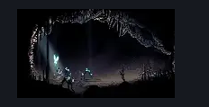
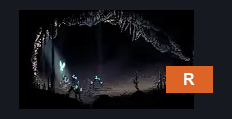
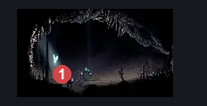

# Wormways Zango Arena (Crawl_10)

**Game ID:** Crawl_10

**Contributors:** herounit, cry

## Subrooms

No subrooms defined.

## Room Transitions

| Alias | Name | From subroom | Destination | Destination alias | Requirements | TODO | Verification | Annotated | Notes |
| --- | --- | --- | --- | --- | --- | --- | --- | --- | --- |
| R | right |  | [Wormways Lower West (Crawl_09)](wormways-lower-west.md) | L | none |  | Verified | ✓ |  |

## Subroom Connections

No subroom connections defined.

## Check Locations

| No. | Check | Subroom | Requirements | TODO | Verification | Location Type | Annotated | Notes |
| --- | --- | --- | --- | --- | --- | --- | --- | --- |
| 1 | plasmified zango boss fight |  | act 3 |  | Verified | boss | ✓ | can extract 4 plasmified blood from this boss, but not listing it as a resource because it can be missed if you just kill the boss without extracting them |

## Room Images

### Scene

### Connections

### Checks

